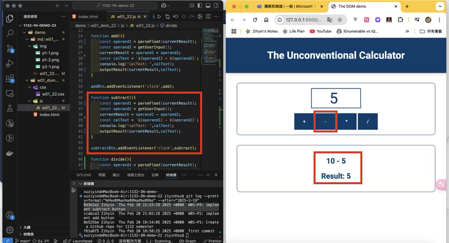

[Github URL](https://github.com/zihyinhsu/1132-1N-demo-22)

### W01-P1: Create a Github repo for 1132 semester
#### => Github repo


#### share to teacher and TA


```
8e525be Zihyin  Thu Feb 20 19:14:05 2025 +0800  W01-P1: Create a Github repo for 1132 semester
```

### W01-P2: implement add button
 

 
```
ccabca3 Zihyin  Thu Feb 20 21:02:28 2025 +0800  W01-P2: implement add button
```

### W01-P3: implement divide button


 
```
```
 
### W01-P4: implement subtract button
 

 
```
 0d3b2a2 Zihyin  Thu Feb 20 22:53:29 2025 +0800  W01-P4: implement subtract button
```
 
### W01-P5: implement multiply button
 

 
```
 
```