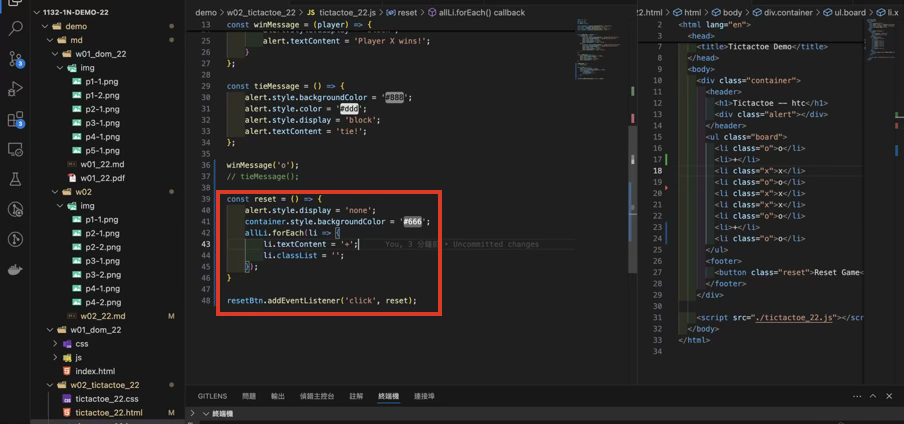
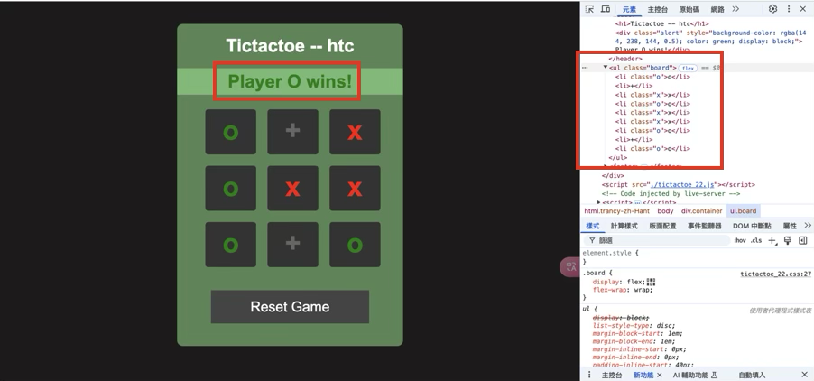
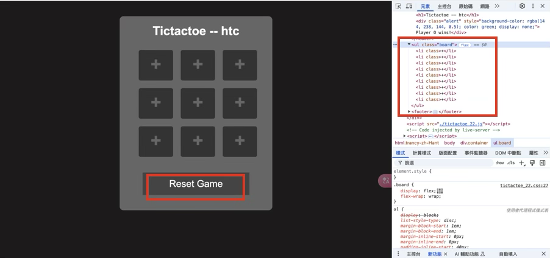

[Github URL](https://github.com/zihyinhsu/1132-1N-demo-22)

### Video: W02-P1: refine the code in week 1 using ony one compute function


```
9cd35ba Zihyin  Thu Feb 27 19:33:08 2025 +0800  W02-P1: refine the code in week 1 using ony one compute function
```

### W02-P2: show winning message and tie message


#### ==> play x wins


#### ==> tie


```
9030f37 Zihyin  Sat Mar 1 21:39:30 2025 +0800   W02-P2: show winning message and tie message
```

### W02-P3: implement reset button



#### ==> initially player o win



#### ==> after reset button is pressed



```
```