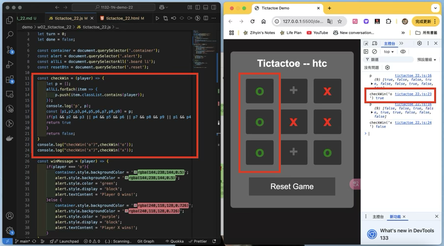
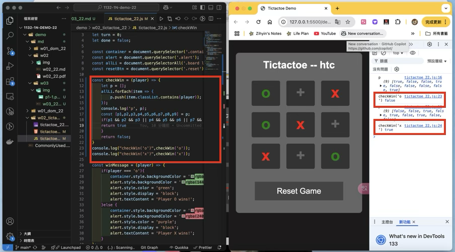
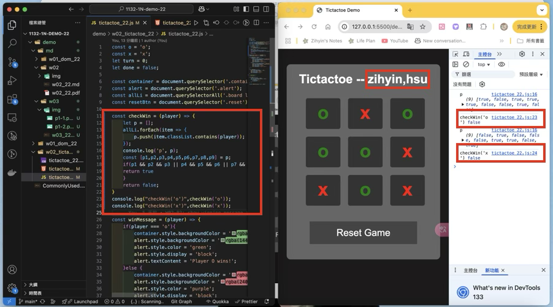

[Github URL](https://github.com/zihyinhsu/1132-1N-demo-22)

W03-P1: Implement checkWin(player) using three different cases
 
#### => player o wins


 
#### => player x wins



#### => no player wins



```
```
