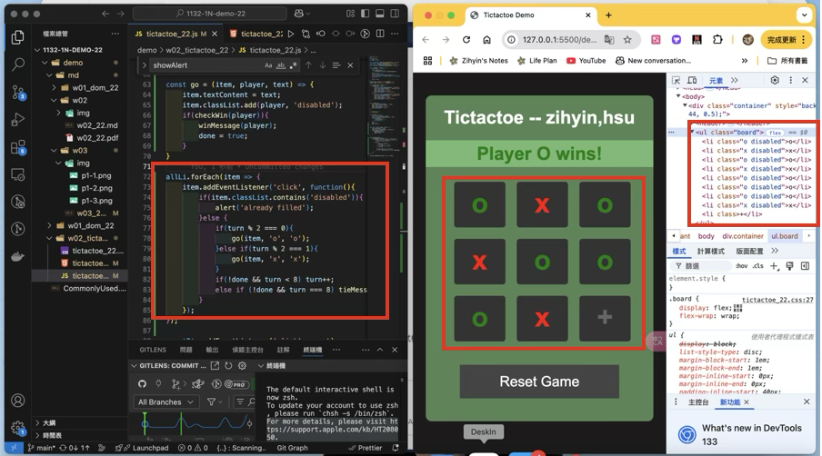
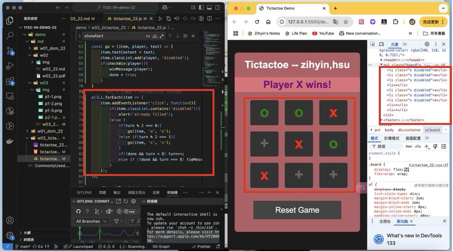
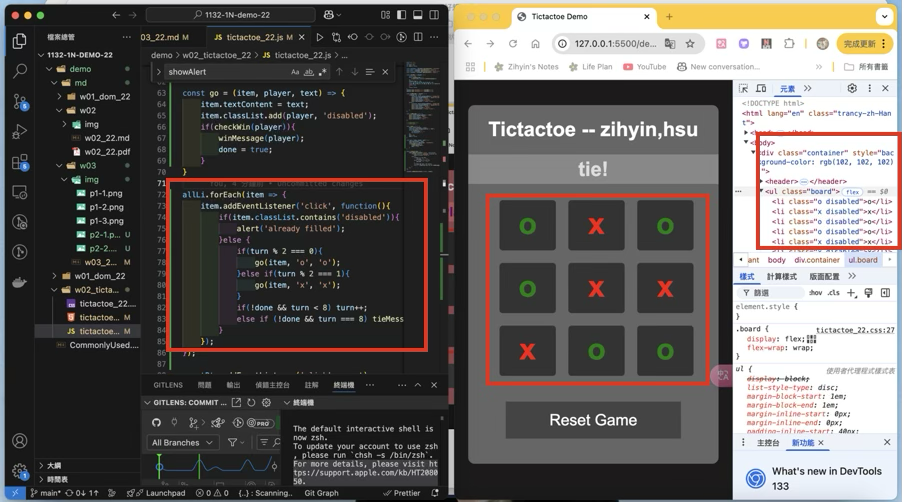
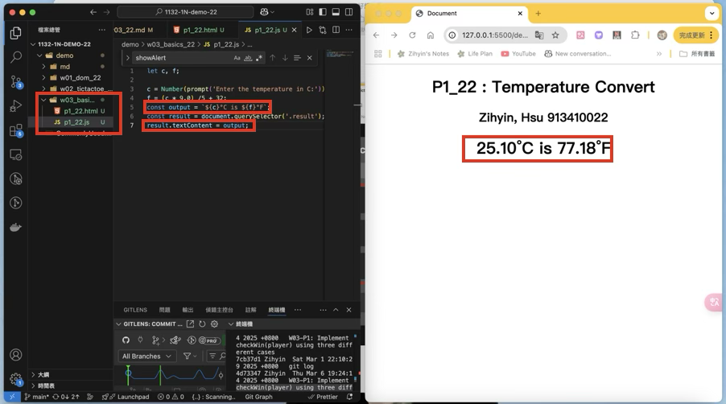

[Github URL](https://github.com/zihyinhsu/1132-1N-demo-22)

### W03-P1: Implement checkWin(player) using three different cases
 
#### => player o wins


 
#### => player x wins


#### => no player wins


```
4d73347 Zihyin  Thu Mar 6 19:24:14 2025 +0800   W03-P1: Implement checkWin(player) using three different cases
```

### W03-P2: play TicTacToe successfully
 
#### => player o wins
 

 
#### => player x wins


 
#### => tie

 
```
74286a9 Zihyin  Thu Mar 6 20:21:46 2025 +0800   W03-P2: play TicTacToe successfully
```

### W03-P3: Temperature Convert from C to F


```
8a194c8 Zihyin  Sat Mar 8 16:39:35 2025 +0800   W03-P3: Temperature Convert from C to F
```
