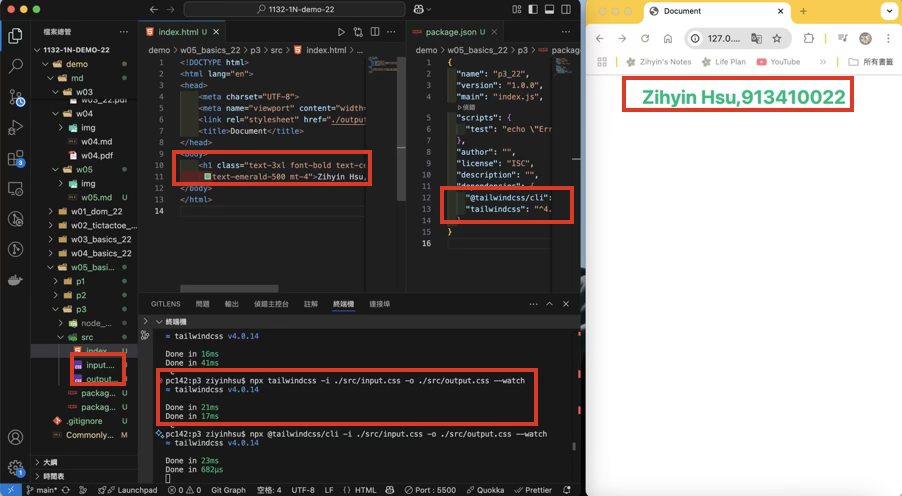
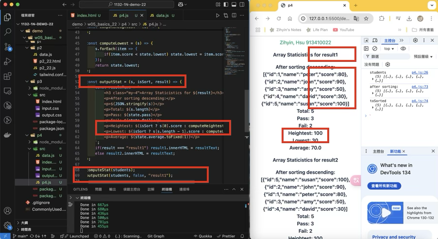
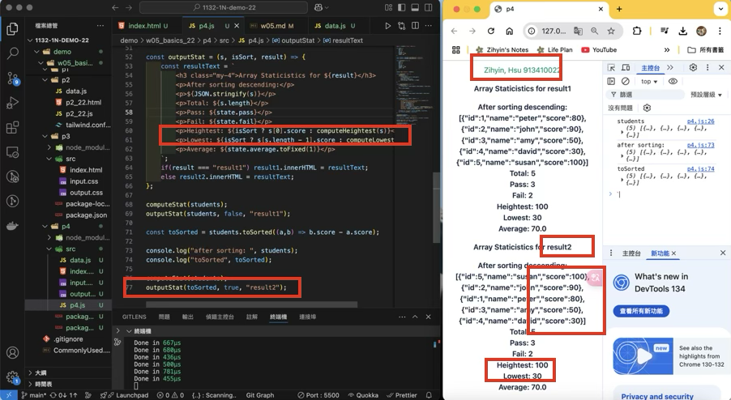
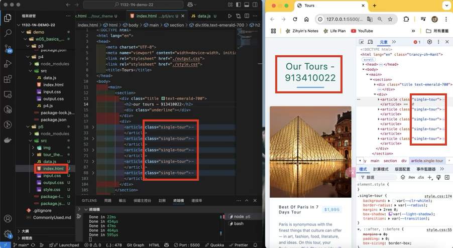
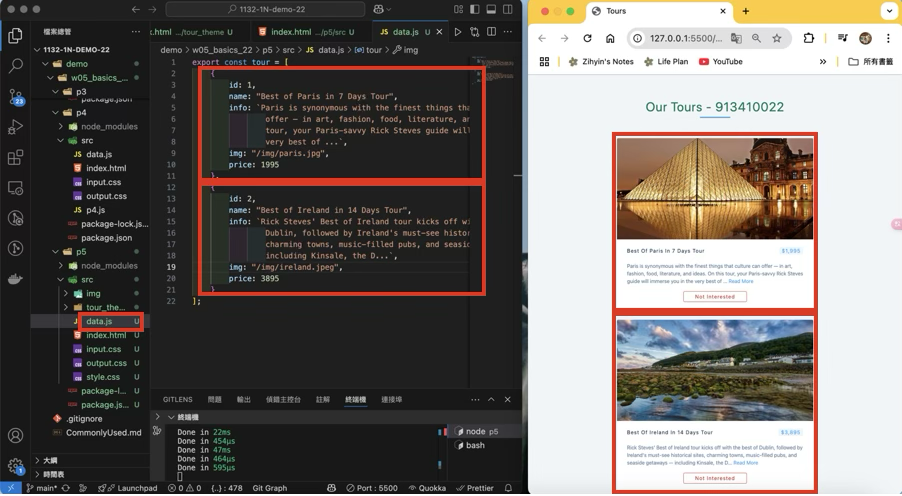

[Github URL](https://github.com/zihyinhsu/1132-1N-demo-22)

### W05-P1: Use Tailwindcss CLI to show tailwind css without internet access



```
0fb9aa3 Zihyin  Thu Mar 20 19:00:49 2025 +0800  W05-P1: Use Tailwindcss CLI to show tailwind css without internet access
```

### W05-P2: use students object array to show statistics

#### => no sorting, show in result1 section



#### => after sorting, show in result2 section



```
93d7e3d Zihyin  Thu Mar 20 20:58:09 2025 +0800  W05-P2: use students object array to show statistics
```

### W05-P3: show 5 tours in p5_xx.html using tour theme

#### => display 5 tours in tour theme, make tailwind css work as well



#### => use array tours_xx to store all data of 5 tours



```
```