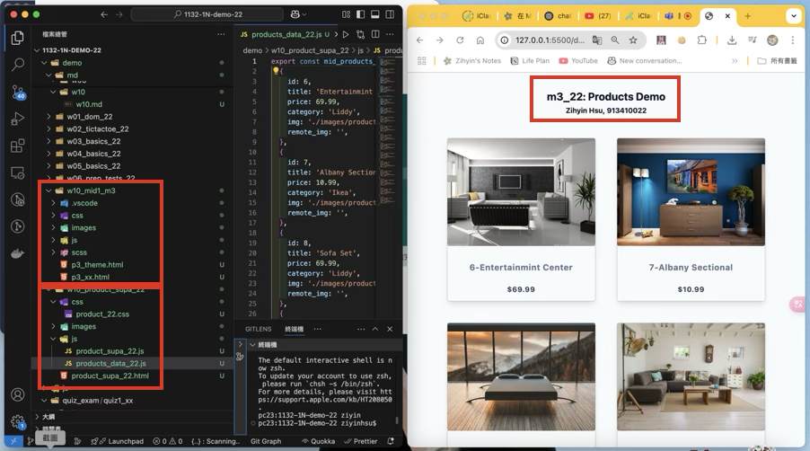
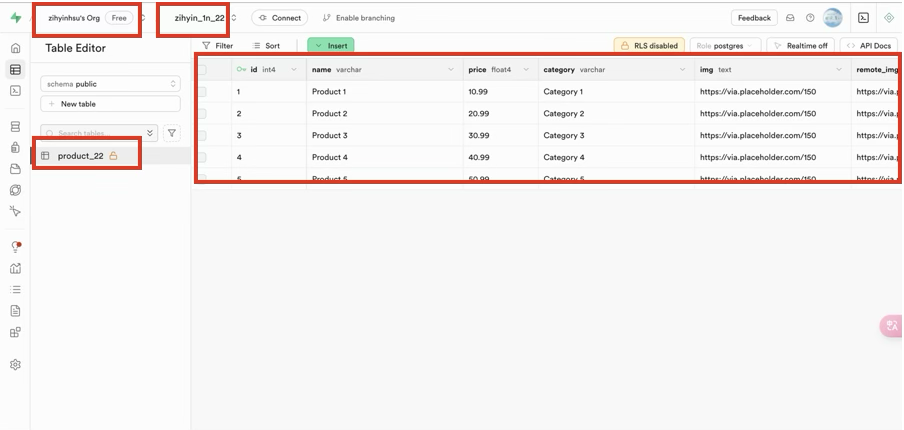
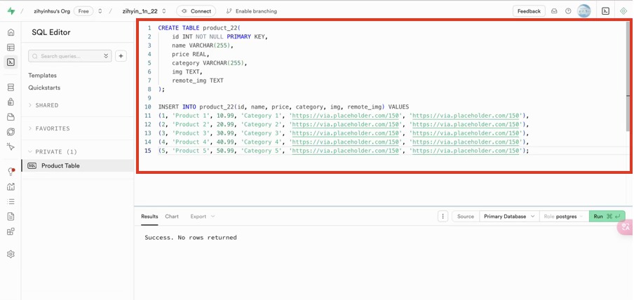
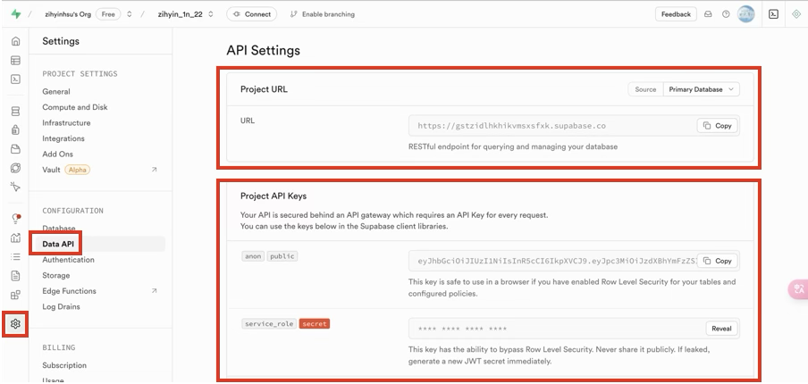
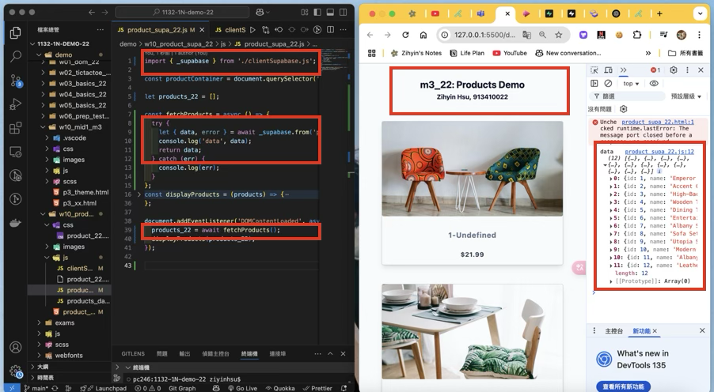
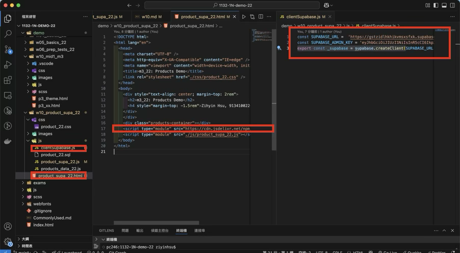

### W10-P1: Copy mid1 m3_xx answer and rearrange it for W10 demo

 
 
```
16d763e Zihyin  Thu Apr 24 18:47:51 2025 +0800  W10-P1: Copy mid1 m3_xx answer and rearrange it for W10 demo
```

### W10-P2: Setup Supabase with project yourcode_1n_xx

#### => show product_xx table with 3 data



#### => show SQL to create product_xx table and insert three data



#### => show Project URL and ANON KEY for this project



```
fc8cfb3 Zihyin  Thu Apr 24 19:34:03 2025 +0800  W10-P2: Setup Supabase with project yourcode_1n_xx
```
 
### W10-P3: Get 12 products from Supabase

#### => show how to fetch products from Supabase



 #### => Show how to get supabase-js to create supabase client



```

```