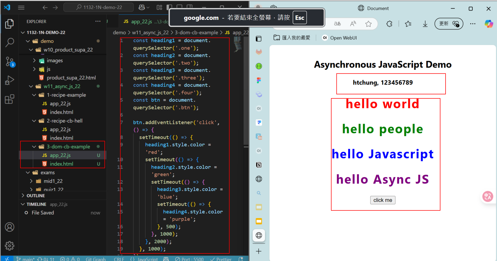
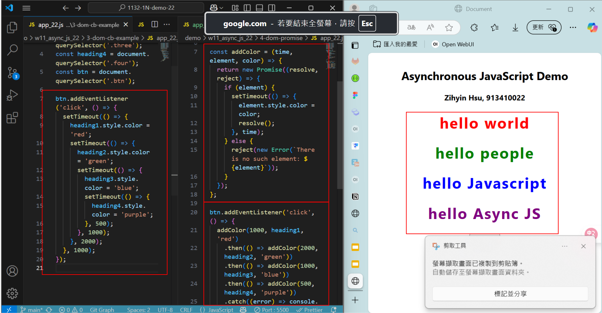
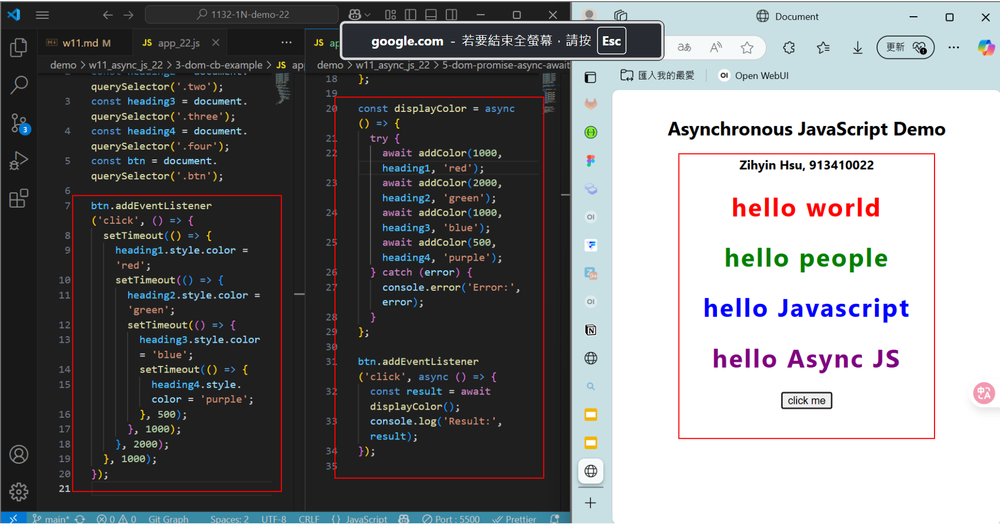
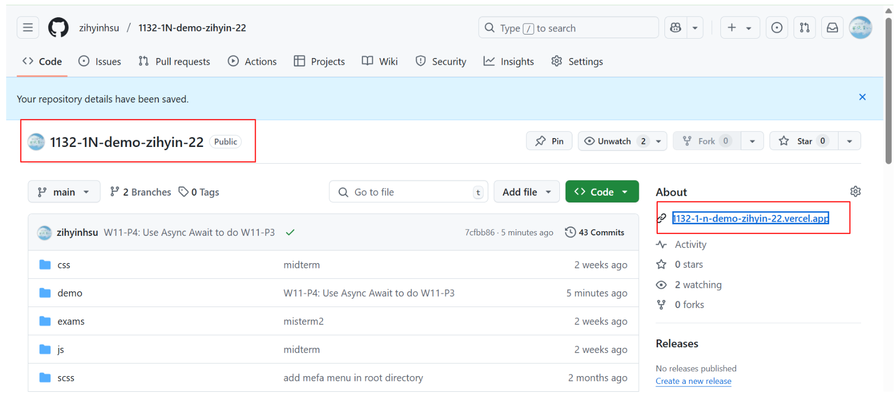

[Github URL](https://github.com/zihyinhsu/1132-1N-demo-22)

[Vercel URL](https://1132-1-n-demo-22.vercel.app/)

### W11-P1: Synchronous vs. Asynchronous

#### => Synchronous demo


#### => Asynchronous demo


```
019b87b Zihyin Hsu Sun May 4 15:32:22 2025 +0800   W11-P1: Synchronous vs. Asynchronous
```

### W11-P2: Asynchronous DOM demo



```
9adc6e1 Zihyin Hsu      Sun May 4 15:42:18 2025 +0800   W11-P2: Asynchronous DOM demo
```

### W11-P3: Use Promise to do W11-P2



```
78a5904 Zihyin Hsu      Sun May 4 15:53:34 2025 +0800   W11-P3: Use Promise to do W11-P2
```

### W11-P4: Use Async Await to do W11-P3



```

```

### W11-P5: Change Github repo name, and Vercel URL

#### => Github



#### => Vercel


```

```
