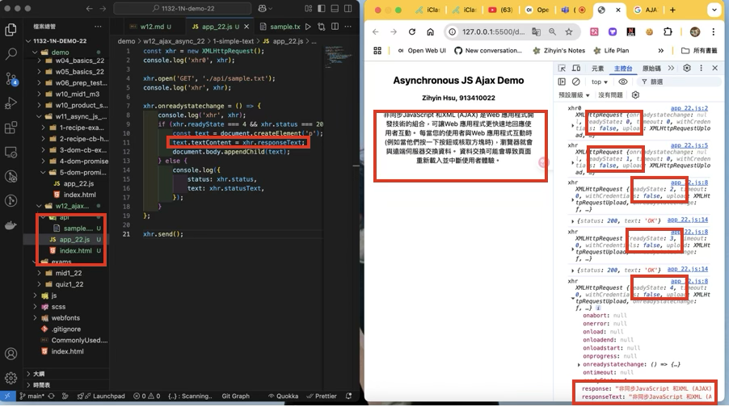
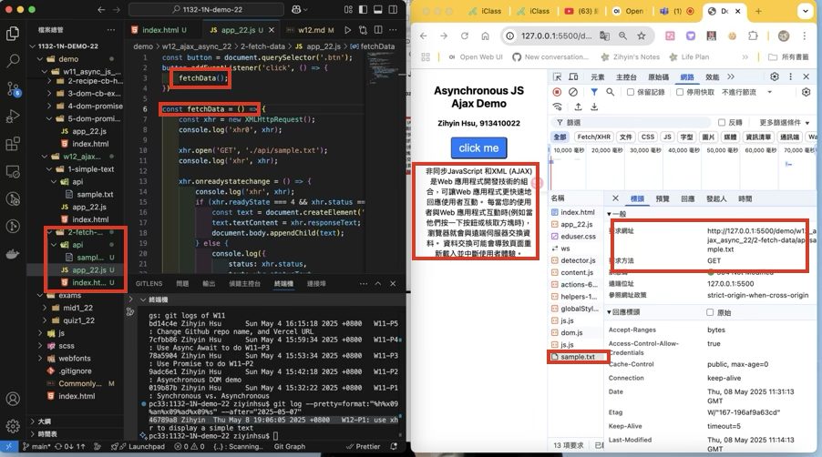
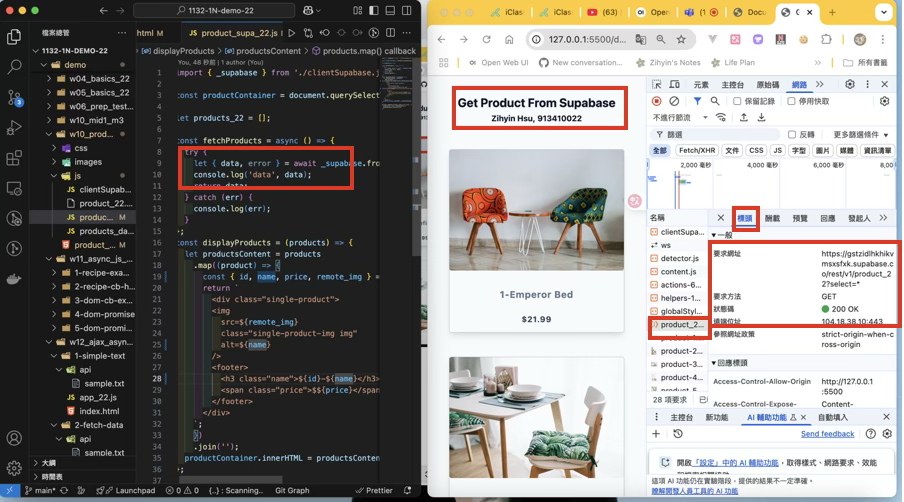
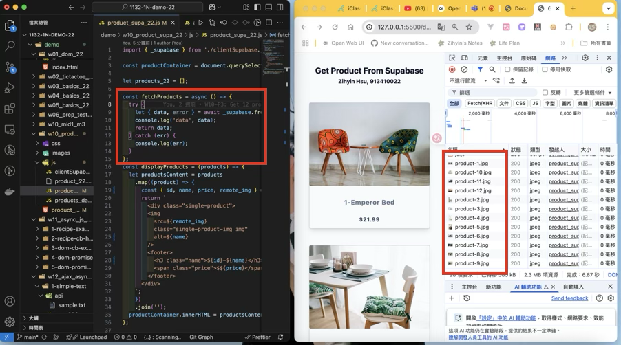

[Github URL](https://github.com/zihyinhsu/1132-1N-demo-zihyin-22)

[Vercel URL](https://1132-1-n-demo-zihyin-22.vercel.app/)

### W12-P1: use xhr to display a simple text
 


```
46789a8 Zihyin  Thu May 8 19:06:05 2025 +0800   W12-P1: use xhr to display a simple text
```

### W12-P2: click a button to fetch data


 
```
0403045 Zihyin  Thu May 8 19:57:00 2025 +0800   W12-P2: click a button to fetch data
```

### W12-P3: Run w10_product_supa_xx, see how it works
 
#### => \_supabase.from('product_xx').select('\*');


 
#### => check response

 
#### => check how many http requests being done in fetchProducts

