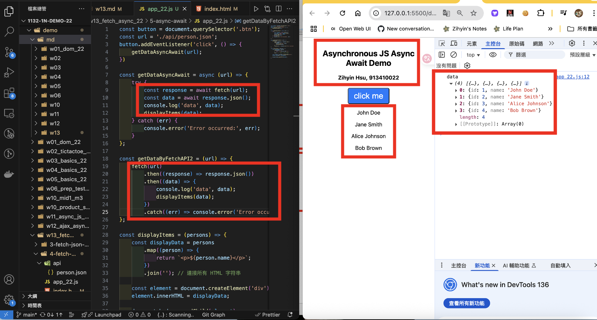

[Github URL](https://github.com/zihyinhsu/1132-1N-demo-zihyin-22)

[Vercel URL](https://1132-1-n-demo-zihyin-22.vercel.app/)

### W13-P1: Use fetch API to replace xhr approach


```
0abb831 Zihyin  Thu May 15 19:24:42 2025 +0800  W13-P1: Use fetch API to replace xhr approach
```

### W13-P2: Use Async Await to replace fetch API approach



```
9a910d9 Zihyin  Thu May 15 19:47:22 2025 +0800  W13-P2: Use Async Await to replace fetch API approach
```

### W13-P3: Get meals about cheese from TheMealDB


```
5610428 Zihyin  Thu May 15 20:14:03 2025 +0800  W13-P3: Get meals about cheese from TheMealDB
```

### W13-P4: Get Products from local json and from API


#### => Get products from local json 


#### => Get products from API


```
```