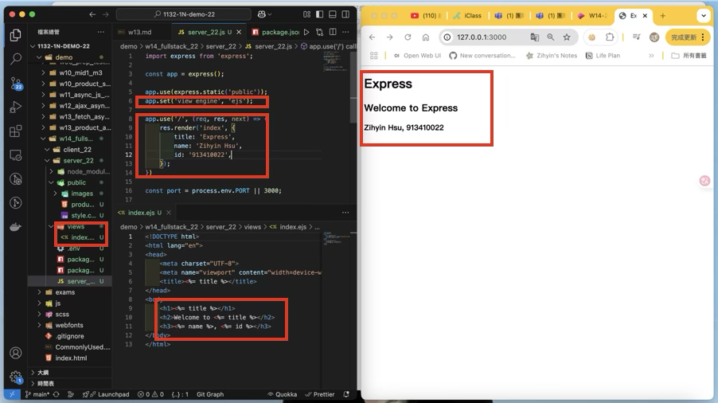
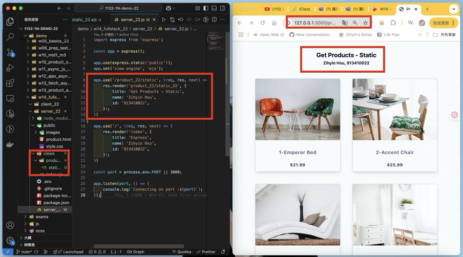
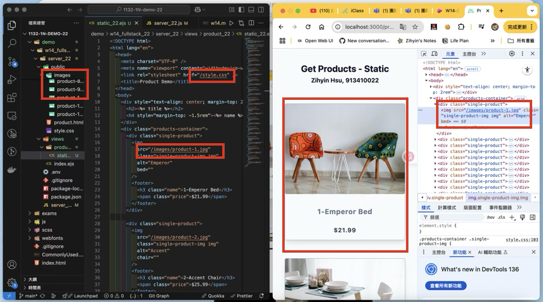
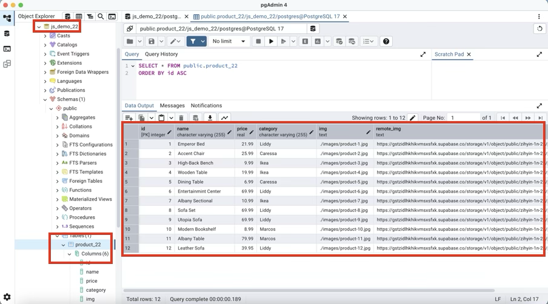
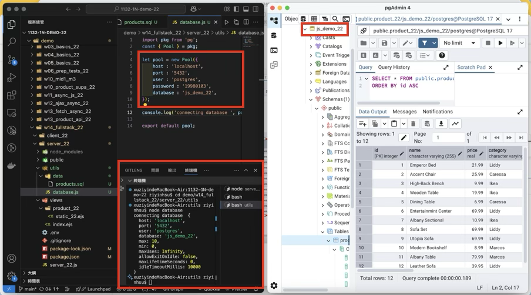
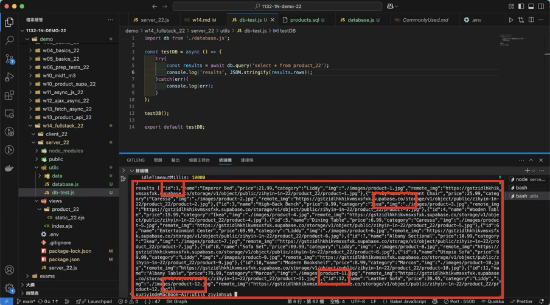
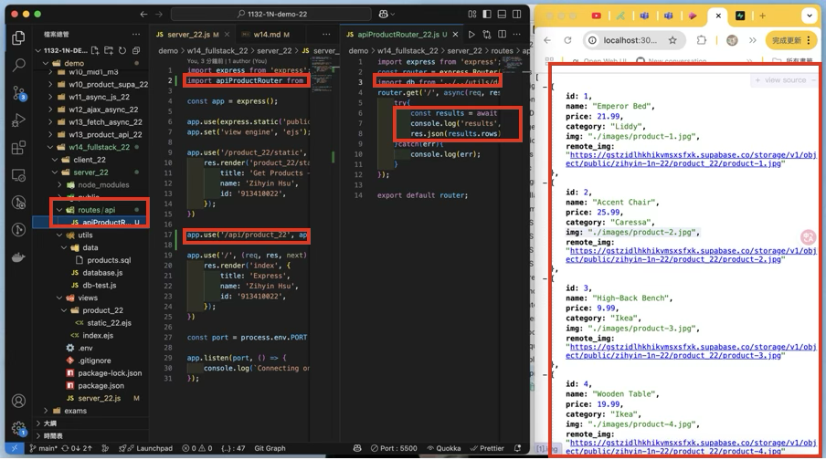

[Github URL](https://github.com/zihyinhsu/1132-1N-demo-zihyin-22)

[Vercel URL](https://1132-1-n-demo-zihyin-22.vercel.app/)


### W14-P1: show first welcome page




```
20dcdb2 Zihyin  Sun May 25 21:31:45 2025 +0800       W14-P1: show first welcome page
```

### W14-P2: Show static products page

#### => show render page with data passed into ejs page



#### => show how the product-1.jpg can be accessed fro public directory as root directory



```
63ecc20 Zihyin  Sun May 25 22:52:48 2025 +0800  W14-P2: Show static products page
```

### W14-P3: Create database js_demo_xx, table product_xx, and insert 12 data, write test code to get all products
 
#### => Create database js_demo_xx, table product_xx, and insert 12 data



#### => connect js_demo_xx database



#### => get all product data



```
a81fd2d Zihyin  Sun May 25 23:38:56 2025 +0800  W14-P3: Create database js_demo_xx, table product_xx, and insert 12 data, write test code to get all products
```

### W14-P4: implement route /api/product_xx to return json data

#### =>



```
abd4472 Zihyin  Sun May 25 23:49:51 2025 +0800  W14-P4: implement route /api/product_xx to return json data
```