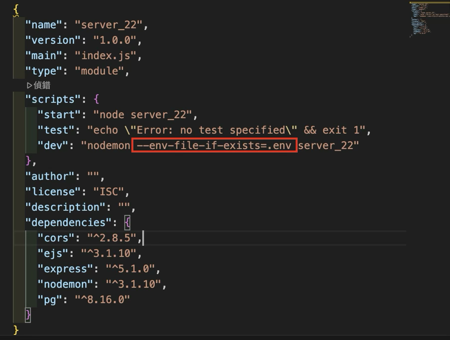
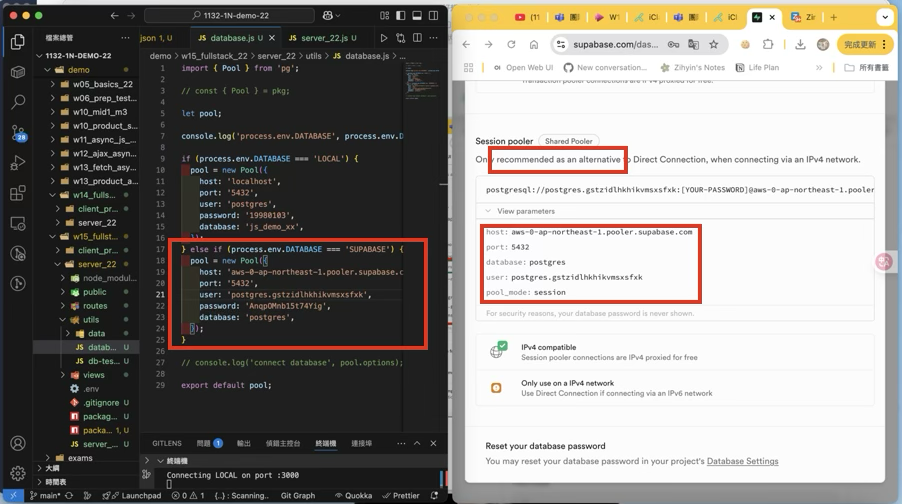
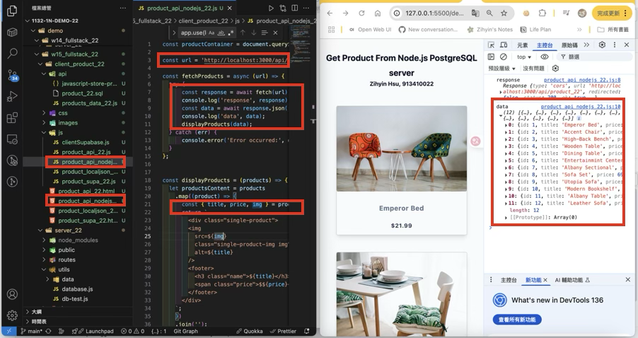
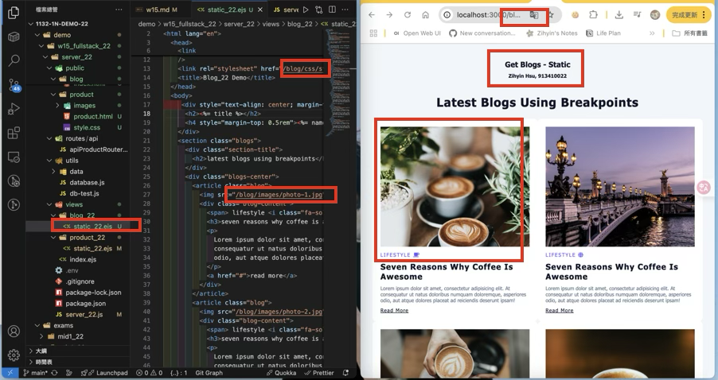
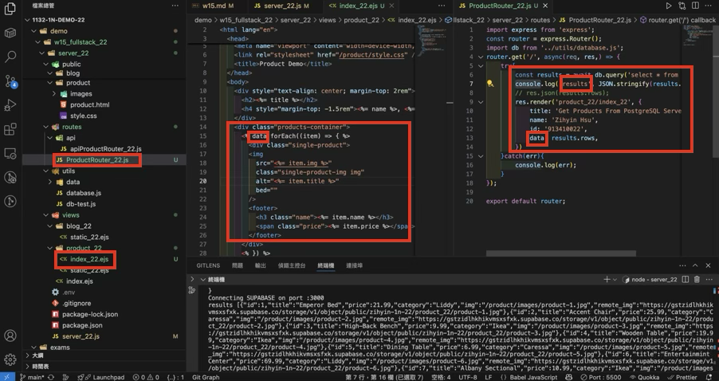
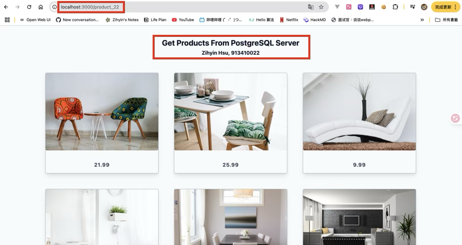

[Github URL](https://github.com/zihyinhsu/1132-1N-demo-zihyin-22)

[Vercel URL](https://1132-1-n-demo-zihyin-22.vercel.app/)

### W15-P1: Set up and test connection to Supabase

#### => add support for .env in package.json


#### => Connection setting to Supabase


#### => For route /api/product_xx, get json from Supabase


```
060a0ff Zihyin  Mon Jun 2 20:28:18 2025 +0800   W15-P1: Set up and test connection to Supabase
```

### Video: W15-P2: Get /api/product_xx json and show it in the client side
 
#### =>


 
```
8482b15 Zihyin  Tue Jun 3 20:12:37 2025 +0800   W15-P2: Get /api/product_xx json and show it in the client side
```

### W15-P3: Show static page of blog theme



```
87e3829 Zihyin  Tue Jun 3 21:01:24 2025 +0800   W15-P3: Show static page of blog theme
```

### W15-P4: Implement route /product_xx to get json data from PostgreSQL server and display them in ejs file
 
#### => related code

 
#### => Chrome

 
```
affa728 Zihyin  Tue Jun 3 21:46:47 2025 +0800   W15-P4: Implement route /product_xx to get json data from PostgreSQL server and display them in ejs file
```