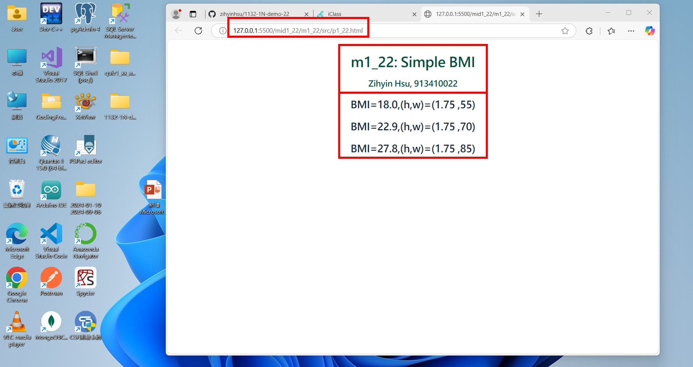
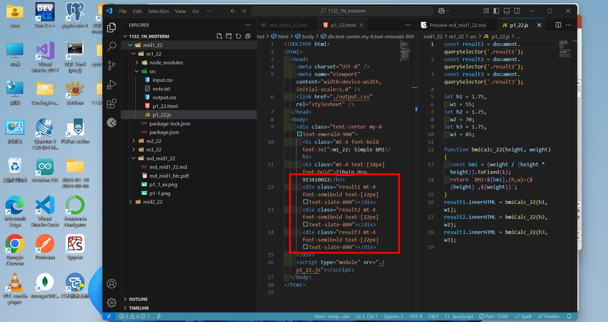
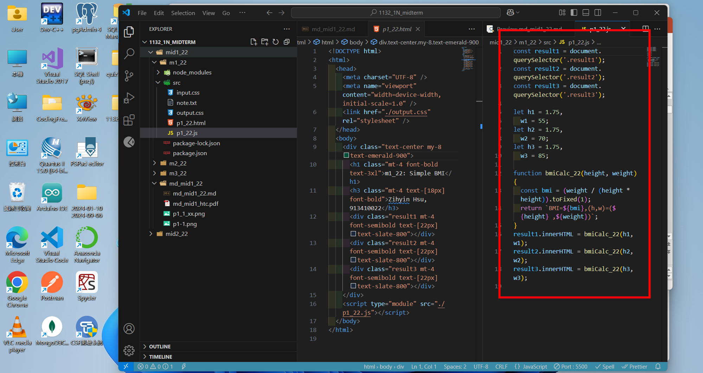
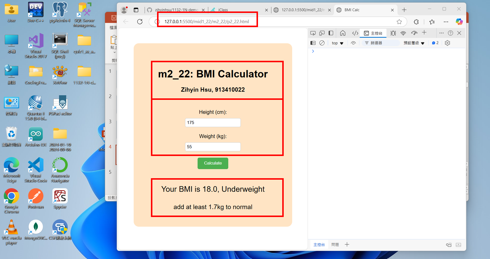
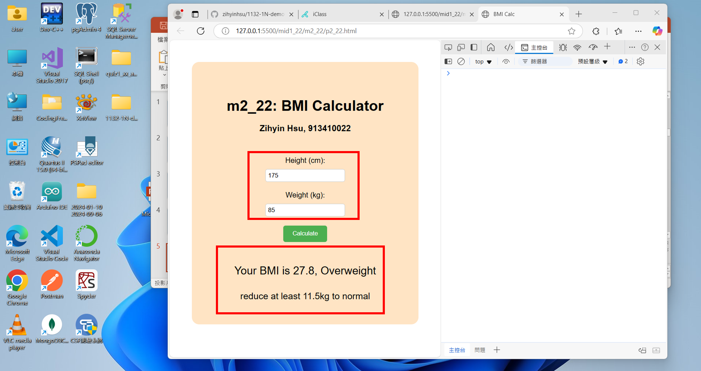
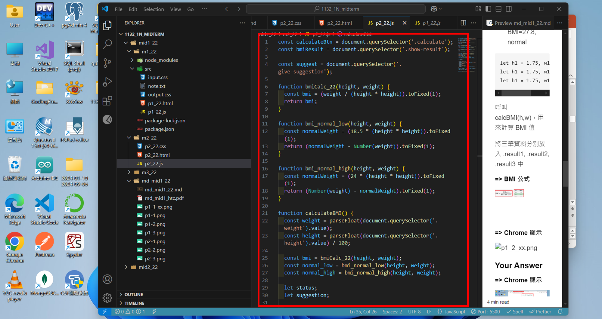
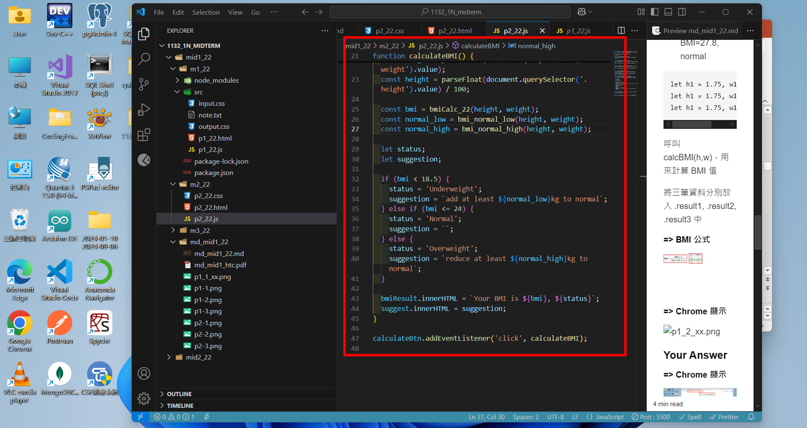
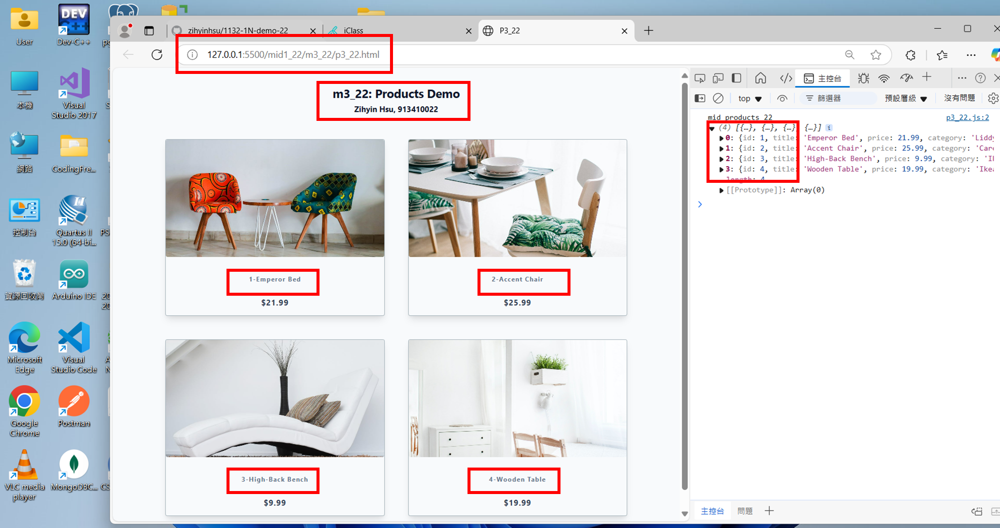
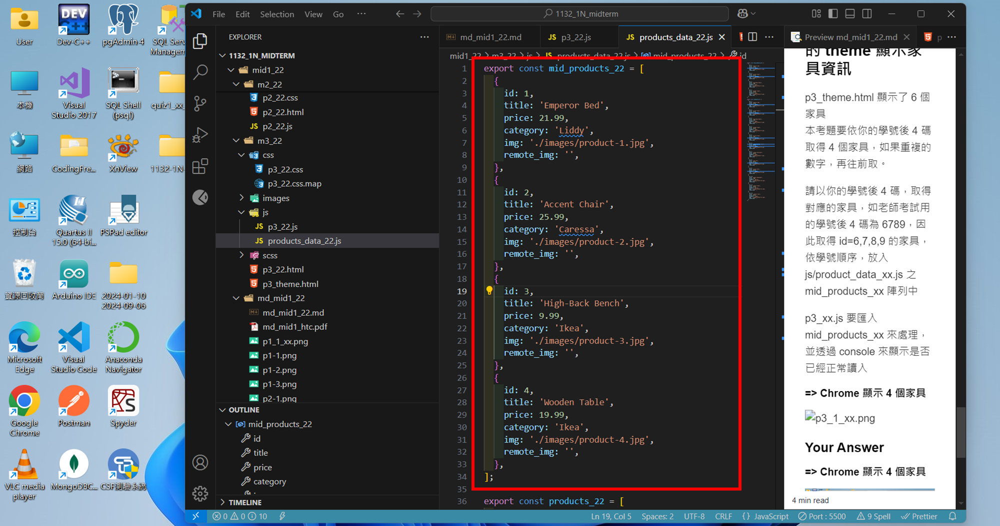
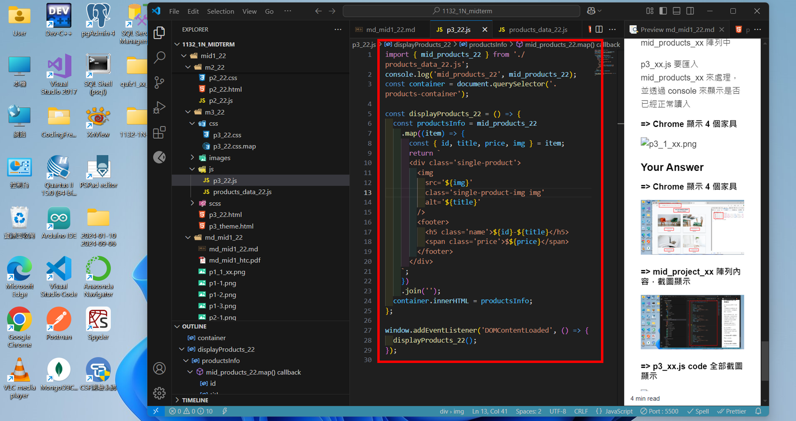

# (60%) 113-2 JavaScript 網頁設計一 期中 mid1 -- 斷網考試

##### 2025-04-17, at E201, from 18:20~20:50

#### Note:

1. mid1 是斷網考試，mid2 是開放網路考試，如果 mid1 題目已經完成 (P1, P2, P3)，可以開始做 mid2 題目不須網路的部分 (P4)
2. 請不要發揮同學愛，作弊雙方除了本次考試 0 分外，平常分數另扣 20 分，情節嚴重者會送校。
3. iClass 上請繳交 md_mid1_22.pdf, md_mid1_22.zip(md 壓縮檔), mid1_22.zip (code 壓縮檔)，壓縮前請將 node_modules 全部砍掉
4. 請直接將答案寫在 md_mid1_22/md_mid1_22.md 上，老師出題及圖片放在 md_mid1_htc.pdf 上，請依照老師所給的圖片來實作並標註
5. 跟期中考相關的檔案及目錄名稱有 xx 時，必須要改成學號後 2 碼，沒有修改時，會視違犯情況扣分。
6. 每一張圖片要有機房左側背景，圖片上要有你的學號(或後兩碼)，圖片標註要跟老師所標註的類似。違者會依情節扣分。
7. 請自評分數，將每一題的 ? 填入分數，沒有填者，不會批改，以 0 分計算。

##### Your (Name, ID): (徐姿茵, 913410022)

Mid1: 60% 斷網

- P1 (20%): 20 分
- P2 (20%): 20 分
- P3 (20%): 20 分

Mid2: 40% 開放網路

- P4 (10%): 10 分
- P5 (20%): 20 分
- P6 (10%): 10 分

##### 總分: 60 分

---

## Mid1: 60%

### (15%) P1: 實作 m1_22, simple BMI

在 p1_22.js 直接設定 3 筆資料如下，

1. (height, weight) = (1.75, 55)，BMI=18.0, lower
2. (height, weight) = (1.75, 70)，BMI=22.9, normal
3. (height, weight) = (1.75, 85)，BMI=27.8, normal

```
let h1 = 1.75, w1 = 55;
let h1 = 1.75, w1 = 70;
let h1 = 1.75, w1 = 85;
```

呼叫 calcBMI(h,w)，用來計算 BMI 值

將三筆資料分別放入 .result1, .result2, .result3 中

##### => BMI 公式


##### => Chrome 顯示


#### Your Answer

##### => Chrome 顯示



##### => p1_22.html code 重點



##### => p1_22.js code 重點



---

### (15%) P2: 實作 m2_22，BMI 是透過圖形介面來計算及顯示

p2_22.html 除了修改個人資料外，其餘部分請勿更動。

##### => Chrome 顯示，BMI 過輕 (Underweight)


##### => Chrome 顯示，BMI 正常 (Normal)


##### => Chrome 顯示，BMI 過重 (Overweight)


#### Your Answer

##### => Chrome 顯示，BMI 過輕 (Underweight)



##### => Chrome 顯示，BMI 正常 (Normal)


##### => Chrome 顯示，BMI 過重 (Overweight)



##### => p2_22.js 全部的 code




---

### (20%) P3: 實作 m3_22，透過所給的 theme 顯示家具資訊

p3_theme.html 顯示了 6 個家具
本考題要依你的學號後 4 碼取得 4 個家具，如果重複的數字，再往前取。

請以你的學號後 4 碼，取得對應的家具，如老師考試用的學號後 4 碼為 6789，因此取得 id=6,7,8,9 的家具，依學號順序，放入 js/product_data_22.js 之 mid_products_22 陣列中

p3_22.js 要匯入 mid_products_22 來處理，並透過 console 來顯示是否已經正常讀入

##### => Chrome 顯示 4 個家具


#### Your Answer

##### => Chrome 顯示 4 個家具



##### => mid_project_22 陣列內容，截圖顯示



##### => p3_22.js code 全部截圖顯示



---
